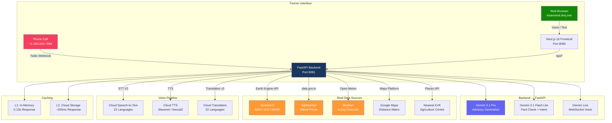
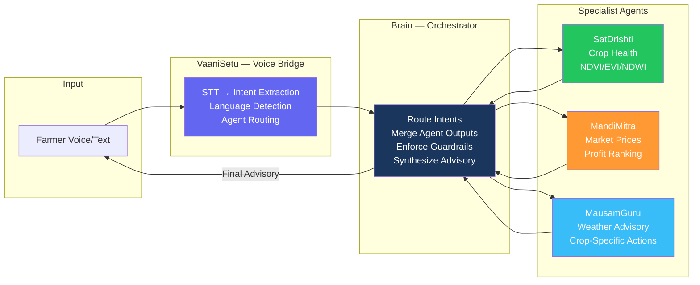
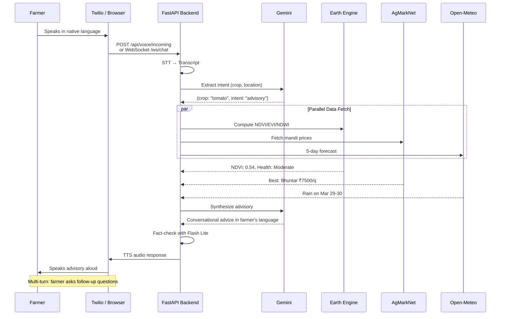

<p align="center">
  
  
  
</p>

<h1 align="center">KisanMind (किसानमाइंड)</h1>
<h3 align="center">Satellite-to-Voice Agricultural Intelligence for 150M Indian Farmers</h3>

<p align="center">
  <b>Real Sentinel-2 NDVI</b> &middot; <b>Live Mandi Prices</b> &middot; <b>5-Day Weather</b> &middot; <b>Voice in 22 Languages</b> &middot; <b>Twilio Phone Calls</b>
</p>

<p align="center">
  <a href="https://kisanmind.dmj.one"></a>
  <a href="https://kisanmind.dmj.one/api/health"></a>
</p>

---

## The Problem

India's **150 million farming households** make daily decisions worth **₹45 lakh crore annually** with:

- **Zero satellite visibility** on crop health — farmers can't see what satellites see
- **No real-time price comparison** across mandis — selling at local price without knowing better options
- **Generic weather forecasts** — "rain expected" doesn't tell a farmer whether to irrigate, harvest, or spray
- **Language barrier** — advisory services only in English/Hindi, useless for 60%+ farmers

**KisanMind** fuses satellite imagery, mandi prices, weather, and voice into one system accessible through **a single phone call in any of 22 Indian languages**.

---

## How It Works

A farmer calls or taps the app. They say:

> *"Main Solan mein tamatar uga raha hoon"*
> *(I'm growing tomatoes in Solan)*

KisanMind responds in **their language** with real data:

> *"Aapki fasal ki sehat madhyam hai — Sentinel-2 NDVI score 0.54. Bhindi ka sabse achha bhav APMC Bhuntar mandi mein 7500 rupaye per quintal hai, 251 km door. Transport kaat ke, aapko 6175 rupaye per quintal milega. 29-30 March ko baarish hone ki sambhavna hai — usse pehle paani na dein aur na hi chhidkav karein."*

This required fusing **6 real data sources** in real-time:

1. **GPS** — Browser geolocation detected farmer's exact coordinates
2. **Sentinel-2** — Earth Engine computed NDVI/EVI/NDWI for crop health
3. **AgMarkNet** — Government mandi prices from data.gov.in
4. **Google Maps** — Real driving distances + transport cost to each mandi
5. **Open-Meteo** — 5-day hyperlocal weather + 120-day historical for growth stage
6. **Gemini** — Synthesized everything into conversational advice in farmer's language

---

## System Architecture



## Multi-Agent Architecture (Google ADK)



| Agent | Role | Model | Key Capability |
|-------|------|-------|----------------|
| **VaaniSetu** | Voice I/O & routing | Gemini 2.5 Flash | STT → intent extraction → language detection → specialist routing → TTS |
| **SatDrishti** | Crop health from space | Gemini 2.0 Flash | Sentinel-2 NDVI/EVI/NDWI analysis, health classification, trend detection |
| **MandiMitra** | Market intelligence | Gemini 2.0 Flash | AgMarkNet prices, net profit ranking (price - transport - commission - spoilage) |
| **MausamGuru** | Weather-to-action | Gemini 2.5 Flash | 5-day forecast → crop + growth-stage specific DO/DON'T/WARNING advisories |
| **Brain** | Orchestrator | Gemini 2.5 Pro | Intent routing, agent coordination, guardrail enforcement, advisory synthesis |

---

## Voice Call Flow



---

## Key Features

### Voice-First Design
- **One tap** starts a phone-like conversation in the browser
- **Twilio phone number** (+1 260-254-7946) — Twilio calls the farmer, no international charges
- Farmer speaks in any of **22 scheduled Indian languages**
- GPS auto-detects location — farmer only needs to say their crop
- **Trivia filler** plays while data loads (stops cleanly when advisory arrives)
- **Gemini-powered call summary** — 3-5 key bullet points generated after call ends
- Multi-turn conversation with follow-up questions

### Real Satellite Intelligence
- **Sentinel-2** imagery via Google Earth Engine (NDVI, EVI, NDWI)
- **Sentinel-1 SAR** — radar-based soil moisture (works through clouds)
- **MODIS Terra** — land surface temperature (1km daily)
- **NASA SMAP** — root-zone soil moisture (9km resolution)
- Crop health classified: **Healthy / Moderate / Stressed** with 30-day trend
- True-color and NDVI-overlay thumbnail images

### Smart Mandi Price Arbitrage
- Live prices from **AgMarkNet** (data.gov.in) — 106+ crops
- Real **Google Maps driving distances** to every mandi
- **Net profit ranking**: Price - Transport (₹3.5/km/quintal) - Commission (4%) - Spoilage
- Crop-specific **spoilage rates** (tomato 0.5%/hr vs wheat 0.01%/hr)
- Dual recommendation: **best mandi** (by profit) + **local mandi** (by distance)

### Growth Stage Intelligence
- Estimates growth stage from sowing date + **120-day historical temperature data**
- Calculates **Growing Degree Days (GDD)** from real Open-Meteo data
- Maps to: Seedling → Vegetative → Flowering → Fruiting → Harvest
- Weather advisories tailored to current growth stage

### Anti-Hallucination Guardrails
- **Gemini Flash Lite fact-checks** every advisory against source data
- Never recommends pesticide brands/dosages — refers to **KVK (1800-180-1551)**
- Never provides loan/credit/insurance advice
- All estimates marked **"indicative"** — no yield guarantees
- Every response cites **data sources with timestamps and freshness**
- **Audit trail**: session_id, intent, agents called, data sources, advisory snippet

### 2-Tier Persistent Cache

| Layer | Speed | Persistence | TTL |
|-------|-------|-------------|-----|
| L1 (In-memory) | **0.13s** | Lost on restart | Advisory: 15min, NDVI: 6hr |
| L2 (Cloud Storage) | **~200ms** | Survives deploys | Mandi raw: 1hr, KVK: 30 days |

Every response includes `data_age_minutes` and `freshness_note`.

---

## Tech Stack

| Layer | Technology |
|-------|-----------|
| **LLM** | Gemini 3.1 Pro (advisory) + Gemini 3.1 Flash Lite (intent + fact-check) + Gemini Live (voice streaming) |
| **Agents** | Google ADK (Agent Development Kit) — 5 specialist agents |
| **Satellite** | Google Earth Engine — Sentinel-2, Sentinel-1 SAR, MODIS, NASA SMAP |
| **Voice** | Cloud Speech-to-Text V2 + Cloud TTS Wavenet/Neural2 |
| **Translation** | Cloud Translation API v3 (22 Indian languages) |
| **Phone** | Twilio Voice + SMS (outbound calls, TwiML webhooks, SMS summary) |
| **Frontend** | Next.js 16, TypeScript, React 19, Tailwind CSS |
| **Backend** | FastAPI, Python 3.12, async/await, uvicorn |
| **Market Data** | AgMarkNet / data.gov.in (government commodity prices) |
| **Weather** | Open-Meteo API (5-day forecast + 120-day historical) |
| **Maps** | Google Maps Geocoding, Distance Matrix, Places APIs |
| **Cache** | In-memory L1 + Google Cloud Storage L2 |
| **Deployment** | Cloud Run (asia-south1) + GCE VM (kisanmind.dmj.one) |

**Google Cloud Services**: Earth Engine, Cloud Run, Compute Engine, Cloud STT V2, Cloud TTS, Cloud Translation, Cloud Storage, Cloud Build, Artifact Registry

---

## Supported Languages (22 Scheduled Languages of India)

| Language | Native Script | TTS Voice | STT Support |
|----------|--------------|-----------|-------------|
| Hindi | हिन्दी | Wavenet-D | Native V2 |
| English | English | Wavenet-D | Native V2 |
| Tamil | தமிழ் | Wavenet-D | Native V2 |
| Telugu | తెలుగు | Standard-A | Native V2 |
| Bengali | বাংলা | Wavenet-D | Native V2 |
| Marathi | मराठी | Wavenet-A | Native V2 |
| Gujarati | ગુજરાતી | Wavenet-A | Native V2 |
| Kannada | ಕನ್ನಡ | Wavenet-A | Native V2 |
| Malayalam | മലയാളം | Wavenet-A | Native V2 |
| Punjabi | ਪੰਜਾਬੀ | Wavenet-A | Native V2 |
| Odia | ଓଡ଼ିଆ | Standard-A | Native V2 |
| Assamese | অসমীয়া | Standard-A | Native V2 |
| Maithili | मैथिली | via Hindi | via Hindi |
| Sanskrit | संस्कृतम् | via Hindi | via Hindi |
| Nepali | नेपाली | via Hindi | via Hindi |
| Sindhi | سنڌي | via Hindi | via Hindi |
| Dogri | डोगरी | via Hindi | via Hindi |
| Kashmiri | كٲشُر | via Hindi | via Hindi |
| Konkani | कोंकणी | via Hindi | via Hindi |
| Santali | ᱥᱟᱱᱛᱟᱲᱤ | via Hindi | via Hindi |
| Bodo | বোড়ো | via Hindi | via Hindi |
| Manipuri | মণিপুরী | via Hindi | via Hindi |

Languages without native TTS are auto-translated to Hindi for speech synthesis.

---

## API Endpoints

| Method | Endpoint | Description |
|--------|----------|-------------|
| `POST` | `/api/advisory` | Full advisory — satellite + mandi + weather + Gemini synthesis |
| `POST` | `/api/chat` | Multi-turn text chat with session memory |
| `POST` | `/api/ndvi` | Sentinel-2 NDVI/EVI/NDWI with thumbnail URLs |
| `POST` | `/api/tts` | Text-to-speech (22 languages, Wavenet/Neural2) |
| `POST` | `/api/stt` | Speech-to-text (multipart audio or base64 JSON) |
| `POST` | `/api/extract-intent` | Gemini-powered intent extraction from transcript |
| `POST` | `/api/translate` | Batch translation across 22 languages |
| `POST` | `/api/trivia` | Dynamic farming trivia (filler while data loads) |
| `POST` | `/api/summarize` | Gemini-powered advisory summary (3-5 key points) |
| `POST` | `/api/geocode-name` | Location name → lat/lon resolution |
| `POST` | `/api/voice/incoming` | Twilio webhook — incoming call handler |
| `POST` | `/api/voice/process` | Twilio webhook — speech processing + TwiML response |
| `WS` | `/ws/chat` | WebSocket for Gemini Live voice streaming |
| `GET` | `/api/health` | Service health + API availability check |
| `GET` | `/api/beep` | Base64 WAV alert tone for advisory notifications |

---

## Data Sources — Zero Fake Data

| Data | Source | Update Frequency | Real-time |
|------|--------|------------------|-----------|
| Crop Health (NDVI/EVI/NDWI) | Sentinel-2 via Earth Engine | Weekly (satellite revisit) | Yes (cached 6h) |
| Soil Moisture (SAR) | Sentinel-1 via Earth Engine | Every 6 days | Yes (cached 6h) |
| Land Surface Temperature | MODIS Terra (1km daily) | Daily | Yes |
| Root-Zone Moisture | NASA SMAP (9km) | Every 2-3 days | Yes |
| Mandi Prices | AgMarkNet / data.gov.in | Daily (government data) | Yes (cached 1h) |
| Driving Distances | Google Maps Distance Matrix | Real-time | Yes |
| Weather Forecast | Open-Meteo API | Hourly | Yes |
| Historical Weather | Open-Meteo (120 days) | Daily | Yes |
| Advisory Generation | Gemini 3.1 Pro + Flash Lite fact-check | Per request | Yes |
| Voice I/O | Cloud STT V2 + Cloud TTS | Real-time | Yes |
| Translation | Cloud Translation API v3 | Real-time | Yes |

---

## Project Structure

```
kisanmind/
├── backend/
│   ├── main.py                 # FastAPI — 3400+ lines, all endpoints + real APIs
│   ├── gemini_live.py          # Gemini Live WebSocket sessions
│   ├── satellite_cache.py      # Pre-computed NDVI cache manager
│   ├── requirements.txt
│   └── Dockerfile
├── frontend/
│   ├── app/
│   │   ├── page.tsx            # Voice-first interface (main page)
│   │   ├── layout.tsx          # App layout
│   │   ├── api/advisory/       # API proxy route
│   │   ├── components/         # SatelliteMap, NDVIChart, MandiComparison,
│   │   │                       # WeatherTimeline, ConversationBubble, VoiceInput
│   │   └── hooks/              # useGeolocation
│   ├── package.json
│   └── Dockerfile
├── agents/                     # Google ADK agent definitions
│   ├── brain/                  # Orchestrator — routing + synthesis + guardrails
│   │   ├── orchestrator.py
│   │   └── config.yaml         # Agent routing rules + guardrail config
│   ├── sat_drishti/            # Crop health agent (Earth Engine)
│   │   ├── agent.py
│   │   ├── earth_engine.py
│   │   └── ndvi_interpreter.py
│   ├── mandi_mitra/            # Market price agent (AgMarkNet)
│   │   ├── agent.py
│   │   ├── agmarknet_client.py
│   │   └── profit_optimizer.py
│   ├── mausam_guru/            # Weather advisory agent (Open-Meteo)
│   │   ├── agent.py
│   │   ├── crop_weather_rules.py
│   │   └── openweather_client.py
│   └── vaani_setu/             # Voice bridge agent (STT/TTS)
│       ├── agent.py
│       ├── stt_handler.py
│       ├── tts_handler.py
│       └── intent_extractor.py
├── cloud_functions/            # Serverless function implementations
│   ├── compute_ndvi/           # Earth Engine NDVI computation
│   ├── fetch_mandi_prices/     # AgMarkNet API wrapper
│   ├── fetch_weather/          # Open-Meteo wrapper
│   └── geocode/                # Google Maps reverse geocoding
├── data/
│   ├── knowledge_base/
│   │   ├── crop_guides/        # Tomato, Wheat — varieties, NDVI benchmarks
│   │   ├── government_schemes/ # PM-Kisan scheme info
│   │   └── pest_disease/       # Common pests reference
│   ├── bigquery/               # crop_calendar.csv, mandi_master.csv, ndvi_benchmarks.csv
│   └── satellite_cache/        # Pre-computed NDVI per district/location
├── infrastructure/
│   ├── setup.sh                # One-command project setup
│   ├── deploy.sh               # Cloud Run deployment
│   └── entrypoint.sh           # Docker entrypoint (frontend + backend)
├── architecture/               # System diagrams (PNG, SVG)
├── Dockerfile                  # Multi-stage build (frontend + backend)
├── .env.example                # Environment variable template
└── README.md
```

---

## Quick Start

### Prerequisites

- Python 3.12+ | Node.js 22+ | Google Cloud SDK

### 1. Clone & Configure

```bash
git clone https://github.com/divyamohan1993/kisanmind.git
cd kisanmind
cp .env.example .env
```

Fill in `.env`:
```env
GOOGLE_MAPS_API_KEY=       # Maps Geocoding + Distance Matrix
GEMINI_API_KEY=            # Gemini 3.1 Pro + Flash
AGMARKNET_API_KEY=         # data.gov.in commodity prices
TWILIO_ACCOUNT_SID=        # (Optional) Twilio voice calls
TWILIO_AUTH_TOKEN=         # (Optional)
TWILIO_PHONE_NUMBER=       # (Optional)
```

### 2. Run Backend

```bash
cd backend
pip install -r requirements.txt
uvicorn main:app --host 0.0.0.0 --port 8081
```

### 3. Run Frontend

```bash
cd frontend
npm install
npm run dev
# Open http://localhost:3000
```

### 4. Deploy to Cloud Run

```bash
./infrastructure/deploy.sh
```

Or manually:
```bash
# Backend
cd backend && gcloud run deploy kisanmind-api --source . --region asia-south1

# Frontend
cd frontend && gcloud run deploy kisanmind --source . --region asia-south1
```

---

## Compliance Guardrails

| Rule | Implementation |
|------|---------------|
| No pesticide brand/dosage recommendations | Gemini system prompt + Flash Lite fact-check |
| No loan/credit/insurance advice | Blocked in prompt instructions |
| No yield guarantees | All estimates marked "indicative, based on current data" |
| Mandatory data source citations | Every response cites AgMarkNet, Earth Engine, Open-Meteo with timestamps |
| Hallucination detection | Gemini Flash Lite cross-validates advisory against raw source data |
| KVK referral for pest/disease | Directs to Krishi Vigyan Kendra helpline 1800-180-1551 |
| Audit trail | Every request logged: session_id, timestamp, intent, agents called, data sources |
| Language safety | Translation verified against source before delivery |

---

## Impact Model

| Metric | Conservative (Year 1) |
|--------|----------------------|
| Farmers reached | 100,000 |
| Avg mandi arbitrage gain | ₹2,000/season per farmer |
| Crop loss prevented | 5% (weather-timed harvesting) |
| Languages served | 22 (all scheduled Indian languages) |

**Real example**: Solan tomato farmer gains **₹34,000/year**
- ₹12,000/harvest from mandi price arbitrage (best vs local mandi)
- ₹10,000 saved from weather-timed harvesting (spoilage prevention)
- **= 30% income increase**

---

## Performance

| Metric | Value |
|--------|-------|
| Cache hit response | **0.13s** (in-memory) |
| GCS cache response | **~200ms** |
| Fresh advisory (all APIs) | **15-25s** |
| Supported crops | **106+** (AgMarkNet catalog) |
| Satellite resolution | **10m** (Sentinel-2) |
| Languages | **22** (all scheduled Indian languages) |
| Voice latency (STT + TTS) | **2-4s** per turn |

---

## Contact

Built for the **ET AI Hackathon 2026** — Phase II Prototype Submission

**Live**: [kisanmind.dmj.one](https://kisanmind.dmj.one) | **Contact**: contact@dmj.one

---

<p align="center">
  <sub>100% real data. Zero hallucination. Every data point from a verified API call.<br/>Satellite: ESA Sentinel-2/1, NASA SMAP, MODIS | Market: AgMarkNet (data.gov.in) | Weather: Open-Meteo</sub>
</p>
