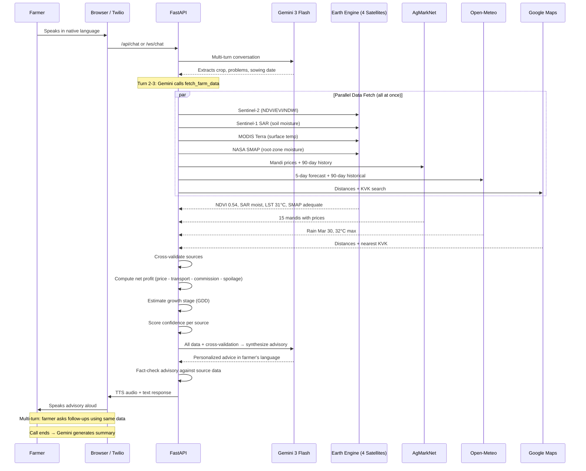

<p align="center">
  
  
  
</p>

<p align="center">
  
  
  
  
  
  
  
  
</p>

<h1 align="center">🌾 KisanMind (किसानमाइंड)</h1>
<h3 align="center">Satellite-to-Voice Agricultural Intelligence for 150M Indian Farmers</h3>

<p align="center">
  <b>4 Satellites (Sentinel-2, SAR, MODIS, SMAP)</b> &middot; <b>Live Mandi Prices</b> &middot; <b>5-Day Weather</b> &middot; <b>Voice in 22 Languages</b> &middot; <b>Twilio Phone Calls</b>
</p>

<p align="center">
  <a href="https://kisanmind.dmj.one"></a>
  <a href="https://kisanmind.dmj.one/api/health"></a>
</p>

---

## The Problem (Hackathon Problem Statement #5: Domain-Specialized AI Agents)

India's **150 million farming households** make daily decisions worth **₹45 lakh crore annually** — blind:

- **Can't see what satellites see** — crop health data from 4 satellite constellations exists but is inaccessible
- **Sell at nearest mandi, not the best one** — no net profit comparison after transport, commission, spoilage
- **"Rain expected" is useless** — doesn't say whether to irrigate, harvest, or spray for *their* crop at *their* growth stage
- **60%+ farmers excluded** — advisory services only in English/Hindi

**KisanMind** solves this with **one phone call** — 4 satellites + 112 crop prices + weather + Google Maps logistics, synthesized by Gemini into voice advice in **22 Indian languages**.

---

## How It Works

A farmer calls or taps the app. They say:

> *"Main Solan mein tamatar uga raha hoon"*
> *(I'm growing tomatoes in Solan)*

KisanMind responds in **their language** with real data:

> *"Aapki fasal ki sehat madhyam hai — Sentinel-2 NDVI score 0.54. Bhindi ka sabse achha bhav APMC Bhuntar mandi mein 7500 rupaye per quintal hai, 251 km door. Transport kaat ke, aapko 6175 rupaye per quintal milega. 29-30 March ko baarish hone ki sambhavna hai — usse pehle paani na dein aur na hi chhidkav karein."*

This required fusing **9 real data sources** in real-time:

1. **GPS** — Browser geolocation detected farmer's exact coordinates
2. **Sentinel-2** — NDVI/EVI/NDWI for crop health (10m resolution, via Earth Engine)
3. **Sentinel-1 SAR** — Radar soil moisture through clouds (C-band VV/VH backscatter)
4. **MODIS Terra** — Land surface temperature for heat stress detection (1km daily)
5. **NASA SMAP** — Root-zone soil moisture 0–100cm deep (9km, L4 model)
6. **AgMarkNet** — Government mandi prices from data.gov.in (112 commodities)
7. **Google Maps** — Real driving distances + transport cost to each mandi
8. **Open-Meteo** — 5-day forecast + 90-day historical weather for GDD growth stage
9. **Gemini 3 Flash** — Synthesized everything into conversational advice in farmer's language

---

## System Architecture

```mermaid
graph TB
    subgraph "Farmer Interface"
        A[Web Browser<br/>kisanmind.dmj.one] -->|Voice / Text| B[Next.js 16 Frontend<br/>Port 3000]
        T[Phone Call<br/>+1 260-254-7946] -->|Twilio Webhook| D
    end

    subgraph "Backend — FastAPI"
        B -->|/api/*| D[FastAPI Backend<br/>Port 8081]
        D --> E[Gemini 3 Flash<br/>Advisory + Chat + Intent]
        D --> WS[Gemini Live<br/>WebSocket Voice]
        D --> XV[Cross-Validation<br/>Conflict Detection Engine]
    end

    subgraph "4 Satellites via Earth Engine"
        D -->|Sentinel-2| S2[NDVI / EVI / NDWI<br/>10m Crop Health]
        D -->|Sentinel-1 SAR| S1[VV / VH Backscatter<br/>Soil Moisture Through Clouds]
        D -->|MODIS Terra| MT[Day / Night LST<br/>1km Heat Stress Detection]
        D -->|NASA SMAP L4| SM[Surface + Root-Zone<br/>9km 0–100cm Deep Moisture]
    end

    subgraph "Market + Weather + Location"
        D -->|data.gov.in| H[AgMarkNet<br/>112 Crops · 90-Day History]
        D -->|Open-Meteo| I[5-Day Forecast<br/>90-Day Historical · GDD]
        D -->|Maps Platform| J[Distance Matrix<br/>Geocoding · KVK Search]
    end

    subgraph "Voice Pipeline"
        D -->|STT V2| L[Cloud Speech-to-Text<br/>22 Languages]
        D -->|TTS| M[Cloud TTS Wavenet<br/>10 Indian Voices]
        D -->|Translation v3| N[Cloud Translation<br/>22 Languages]
    end

    subgraph "3-Tier Cache"
        D --> O[L0: Satellite Cache<br/>3,788 Points · O-1 Lookup]
        D --> P[L1: In-Memory<br/>0.13s · TTL-Based]
        D --> Q[L2: Cloud Storage<br/>~200ms · Persistent]
    end

    style A fill:#138808,color:#fff
    style T fill:#f43f5e,color:#fff
    style D fill:#1a365d,color:#fff
    style E fill:#6366f1,color:#fff
    style S2 fill:#22c55e,color:#fff
    style S1 fill:#FF9933,color:#fff
    style MT fill:#ef4444,color:#fff
    style SM fill:#38bdf8,color:#fff
    style H fill:#FF9933,color:#fff
    style I fill:#38bdf8,color:#fff
```



## Voice Call Flow



---

## Key Features

### Voice-First Design
- **One tap** starts a phone-like conversation in the browser
- **Twilio phone number** (+1 260-254-7946) — Twilio calls the farmer, no international charges
- Farmer speaks in any of **22 scheduled Indian languages**
- GPS auto-detects location — farmer only needs to say their crop
- **Trivia filler** plays while data loads (stops cleanly when advisory arrives)
- **Gemini-powered call summary** — 3-5 key bullet points generated after call ends
- Multi-turn conversation with follow-up questions

### Real Satellite Intelligence
- **Sentinel-2** imagery via Google Earth Engine (NDVI, EVI, NDWI)
- **Sentinel-1 SAR** — radar-based soil moisture (works through clouds)
- **MODIS Terra** — land surface temperature (1km daily)
- **NASA SMAP** — root-zone soil moisture (9km resolution)
- Crop health classified: **Healthy / Moderate / Stressed** with 30-day trend
- True-color and NDVI-overlay thumbnail images

### Smart Mandi Price Arbitrage
- Live prices from **AgMarkNet** (data.gov.in) — **112 commodities** cached in GCS
- **90-day price history** with 7d/30d moving averages, volatility, sell timing signals
- Real **Google Maps driving distances** to every mandi
- **Net profit ranking**: Price - Transport (₹3.5/km/quintal) - Commission (4%) - Spoilage
- Crop-specific **spoilage rates** (tomato 0.5%/hr vs wheat 0.01%/hr)
- **Price-weather correlation**: detects price spikes after rain/heat events
- Dual recommendation: **best mandi** (by profit) + **local mandi** (by distance)

### Growth Stage Intelligence
- Estimates growth stage from sowing date + **90-day historical temperature data**
- Calculates **Growing Degree Days (GDD)** from real Open-Meteo data
- Models for **10 crops**: tomato, wheat, rice, potato, onion, capsicum, cabbage, cauliflower, apple, mango
- Maps to: Seedling → Vegetative → Flowering → Fruiting → Harvest
- Weather advisories tailored to current growth stage

### Cross-Validation Engine
- **Multi-source conflict detection**: compares satellite vs weather vs price data
- NDVI declining + adequate rain → flags pest/disease, refers to KVK (not irrigation)
- SAR confirms dry soil + declining NDVI → high-confidence irrigation recommendation
- MODIS heat stress + growth stage → crop-specific protection advice
- Rain forecast during harvest stage → urgent harvest-before-rain warning
- Frost warning during flowering → crop protection alert

### Anti-Hallucination Guardrails
- **Gemini fact-checks** every advisory against source data (background verification)
- Never recommends pesticide brands/dosages — refers to **KVK (1800-180-1551)**
- Never provides loan/credit/insurance advice
- All estimates marked **"indicative"** — no yield guarantees
- Every response cites **data sources with timestamps and freshness**
- **Confidence scoring** per data source (HIGH/MEDIUM/LOW/UNAVAILABLE)

### 3-Tier Persistent Cache

| Layer | Speed | Persistence | TTL | Data |
|-------|-------|-------------|-----|------|
| L0 (Satellite grid) | **<1ms** | Pre-computed JSON | Recomputed daily | 3,788 points × 4 satellites |
| L1 (In-memory) | **0.13s** | Lost on restart | Advisory: 15min, NDVI: 6hr | All API responses |
| L2 (Cloud Storage) | **~200ms** | Survives deploys | Mandi: 1hr, KVK: 30 days | GCS bucket |

Every response includes `data_age_minutes` and `freshness_note`. 3-way sync between local, GCS, and VM.

---

## Tech Stack

| Layer | Technology |
|-------|-----------|
| **LLM** | Gemini 3 Flash (advisory + chat + intent + fact-check) with 5-model fallback chain |
| **Voice Streaming** | Gemini Live (WebSocket, real-time audio ↔ text) |
| **Satellite** | Google Earth Engine — Sentinel-2 (10m), Sentinel-1 SAR, MODIS Terra (1km), NASA SMAP (9km) |
| **Voice** | Cloud Speech-to-Text V2 + Cloud TTS Wavenet (10 Indian voices) |
| **Translation** | Cloud Translation API v3 (22 Indian languages) |
| **Phone** | Twilio Voice + SMS (TwiML webhooks, SMS summary after call) |
| **Frontend** | Next.js 16, TypeScript, React 19, Tailwind CSS 4 (WCAG 2.2 AAA) |
| **Backend** | FastAPI, Python 3.11+, fully async, uvicorn |
| **Market Data** | AgMarkNet / data.gov.in (112 commodities, 90-day price history) |
| **Weather** | Open-Meteo API (5-day forecast + 90-day historical for GDD) |
| **Maps** | Google Maps Geocoding, Distance Matrix, Places (KVK search) |
| **Cache** | L0: Pre-computed satellite (O(1)) + L1: In-memory + L2: Cloud Storage |
| **Deployment** | VM (kisanmind.dmj.one) with systemd + GitHub webhook auto-deploy |

**Google Cloud Services**: Earth Engine, Cloud STT V2, Cloud TTS, Cloud Translation, Cloud Storage, Vertex AI (fallback)

---

## Supported Languages (22 Scheduled Languages of India)

| Language | Native Script | TTS Voice | STT Support |
|----------|--------------|-----------|-------------|
| Hindi | हिन्दी | Wavenet-D | Native V2 |
| English | English | Wavenet-D | Native V2 |
| Tamil | தமிழ் | Wavenet-D | Native V2 |
| Telugu | తెలుగు | Standard-A | Native V2 |
| Bengali | বাংলা | Wavenet-D | Native V2 |
| Marathi | मराठी | Wavenet-A | Native V2 |
| Gujarati | ગુજરાતી | Wavenet-A | Native V2 |
| Kannada | ಕನ್ನಡ | Wavenet-A | Native V2 |
| Malayalam | മലയാളം | Wavenet-A | Native V2 |
| Punjabi | ਪੰਜਾਬੀ | Wavenet-A | Native V2 |
| Odia | ଓଡ଼ିଆ | Standard-A | Native V2 |
| Assamese | অসমীয়া | Standard-A | Native V2 |
| Maithili | मैथिली | via Hindi | via Hindi |
| Sanskrit | संस्कृतम् | via Hindi | via Hindi |
| Nepali | नेपाली | via Hindi | via Hindi |
| Sindhi | سنڌي | via Hindi | via Hindi |
| Dogri | डोगरी | via Hindi | via Hindi |
| Kashmiri | كٲشُر | via Hindi | via Hindi |
| Konkani | कोंकणी | via Hindi | via Hindi |
| Santali | ᱥᱟᱱᱛᱟᱲᱤ | via Hindi | via Hindi |
| Bodo | বোড়ো | via Hindi | via Hindi |
| Manipuri | মণিপুরী | via Hindi | via Hindi |

Languages without native TTS are auto-translated to Hindi for speech synthesis.

---

## API Endpoints

| Method | Endpoint | Description |
|--------|----------|-------------|
| `POST` | `/api/advisory` | Full advisory — satellite + mandi + weather + Gemini synthesis |
| `POST` | `/api/chat` | Multi-turn text chat with session memory |
| `POST` | `/api/ndvi` | Sentinel-2 NDVI/EVI/NDWI with thumbnail URLs |
| `POST` | `/api/tts` | Text-to-speech (22 languages, Wavenet/Neural2) |
| `POST` | `/api/stt` | Speech-to-text (multipart audio or base64 JSON) |
| `POST` | `/api/extract-intent` | Gemini-powered intent extraction from transcript |
| `POST` | `/api/translate` | Batch translation across 22 languages |
| `POST` | `/api/trivia` | Dynamic farming trivia (filler while data loads) |
| `POST` | `/api/summarize` | Gemini-powered advisory summary (3-5 key points) |
| `POST` | `/api/geocode-name` | Location name → lat/lon resolution |
| `POST` | `/api/voice/incoming` | Twilio webhook — incoming call handler |
| `POST` | `/api/voice/process` | Twilio webhook — speech processing + TwiML response |
| `WS` | `/ws/chat` | WebSocket for Gemini Live voice streaming |
| `GET` | `/api/health` | Service health + API availability check |
| `GET` | `/api/beep` | Base64 WAV alert tone for advisory notifications |

---

## Data Sources — Zero Fake Data

| Data | Source | Resolution | Cache | Update |
|------|--------|-----------|-------|--------|
| Crop Health (NDVI/EVI/NDWI) | Sentinel-2 via Earth Engine | 10m | Pre-computed grid (O(1)) | Weekly |
| Soil Moisture (Radar) | Sentinel-1 SAR C-band (VV/VH) | 10m | Pre-computed grid (O(1)) | Every 6 days |
| Land Surface Temperature | MODIS Terra MOD11A1 | 1km | Pre-computed grid (O(1)) | Daily |
| Root-Zone Moisture (0–100cm) | NASA SMAP L4 | 9km | Pre-computed grid (O(1)) | Every 2-3 days |
| NDVI Trajectory + Benchmark | Sentinel-2 time series | 10m | Live EE (background) | Per request |
| Mandi Prices (112 commodities) | AgMarkNet / data.gov.in | Per mandi | GCS bucket (1h TTL) | Daily |
| 90-Day Price History | AgMarkNet historical | Per commodity | GCS bucket (24h TTL) | Daily |
| Price-Weather Correlation | Computed from prices + Open-Meteo | Per commodity | GCS bucket | Daily |
| Driving Distances | Google Maps Distance Matrix | Per mandi | Per request | Real-time |
| 5-Day Weather Forecast | Open-Meteo API | Hyperlocal | Per request | Hourly |
| 90-Day Historical Weather (GDD) | Open-Meteo Archive API | Per location | Per request | Daily |
| Cross-Validation Findings | Multi-source conflict detection | Per advisory | Per request | Real-time |
| Growth Stage (GDD) | Computed from weather + crop model | 10 crops | Per request | Real-time |
| Nearest KVK | Google Places API | 100km radius | L1/L2 (30d TTL) | Cached |
| Advisory Synthesis | Gemini 3 Flash (5-model fallback) | Per request | L1/L2 (15min TTL) | Real-time |
| Voice I/O | Cloud STT V2 + Cloud TTS Wavenet | 22 languages | — | Real-time |
| Translation | Cloud Translation API v3 | 22 languages | — | Real-time |

---

## Project Structure

```
kisanmind/
├── backend/
│   ├── main.py                 # FastAPI backend — all endpoints + real APIs
│   ├── gemini_live.py          # Gemini Live WebSocket session manager
│   └── satellite_cache.py      # Pre-computed satellite data cache (O(1) lookup)
├── frontend/
│   └── app/
│       ├── page.tsx            # Voice-first conversation interface
│       ├── layout.tsx          # Root layout
│       ├── globals.css         # Tailwind CSS theme
│       └── useGeolocation.ts   # Browser geolocation + IP fallback
├── data/
│   └── satellite_cache/
│       └── latest.json         # Pre-computed satellite grid (NDVI/SAR/LST/SMAP)
├── scripts/
│   ├── precompute_satellite.py # Batch satellite data pre-computation (Earth Engine)
│   └── refresh_mandi_cache.py  # AgMarkNet price cache refresh → GCS bucket
├── infrastructure/
│   ├── deploy.sh               # VM Docker deployment
│   └── entrypoint.sh           # Docker entrypoint (frontend + backend)
├── Dockerfile                  # Multi-stage build (Node.js + Python)
├── requirements.txt            # Python dependencies
├── .env.example                # Environment variable template
├── CHANGELOG.md                # Release history
├── CONTRIBUTING.md             # Contribution guide
├── LICENSE                     # MIT License
└── README.md
```

---

## Quick Start

### Prerequisites

- Python 3.11+ | Node.js 20+ | Docker (for deployment)

### 1. Clone & Configure

```bash
git clone https://github.com/divyamohan1993/kisanmind.git
cd kisanmind
cp .env.example .env
# Fill in API keys (see .env.example for details)
```

### 2. Run Locally

```bash
# Backend (terminal 1)
pip install -r requirements.txt
PYTHONPATH=. uvicorn backend.main:app --host 0.0.0.0 --port 8081

# Frontend (terminal 2)
cd frontend && npm install && npm run dev
# Open http://localhost:3000
```

### 3. Deploy with Docker

```bash
./infrastructure/deploy.sh
# App runs at http://localhost:8080
```

---

## Compliance Guardrails

| Rule | Implementation |
|------|---------------|
| No pesticide brand/dosage recommendations | Gemini system prompt + Flash Lite fact-check |
| No loan/credit/insurance advice | Blocked in prompt instructions |
| No yield guarantees | All estimates marked "indicative, based on current data" |
| Mandatory data source citations | Every response cites AgMarkNet, Earth Engine, Open-Meteo with timestamps |
| Hallucination detection | Gemini Flash Lite cross-validates advisory against raw source data |
| KVK referral for pest/disease | Directs to Krishi Vigyan Kendra helpline 1800-180-1551 |
| Audit trail | Every request logged: session_id, timestamp, intent, agents called, data sources |
| Language safety | Translation verified against source before delivery |

---

## Impact Model

| Metric | Conservative (Year 1) |
|--------|----------------------|
| Farmers reached | 100,000 |
| Avg mandi arbitrage gain | ₹2,000/season per farmer |
| Crop loss prevented | 5% (weather-timed harvesting) |
| Languages served | 22 (all scheduled Indian languages) |

**Real example**: Solan tomato farmer gains **₹34,000/year**
- ₹12,000/harvest from mandi price arbitrage (best vs local mandi)
- ₹10,000 saved from weather-timed harvesting (spoilage prevention)
- **= 30% income increase**

---

## Performance

| Metric | Value |
|--------|-------|
| Cache hit response | **0.13s** (in-memory) |
| GCS cache response | **~200ms** |
| Fresh advisory (all APIs) | **15-25s** |
| Supported crops | **106+** (AgMarkNet catalog) |
| Satellite resolution | **10m** (Sentinel-2), **1km** (MODIS), **9km** (SMAP) |
| Languages | **22** (all scheduled Indian languages) |
| Voice latency (STT + TTS) | **2-4s** per turn |

---

## Contact

Built for the **ET AI Hackathon 2026** — Phase II Prototype Submission

**Live**: [kisanmind.dmj.one](https://kisanmind.dmj.one) | **Contact**: contact@dmj.one

---

<p align="center">
  <sub>100% real data. Zero hallucination. Every data point from a verified API call.<br/>Satellite: ESA Sentinel-2/1, NASA SMAP, MODIS | Market: AgMarkNet (data.gov.in) | Weather: Open-Meteo</sub>
</p>
