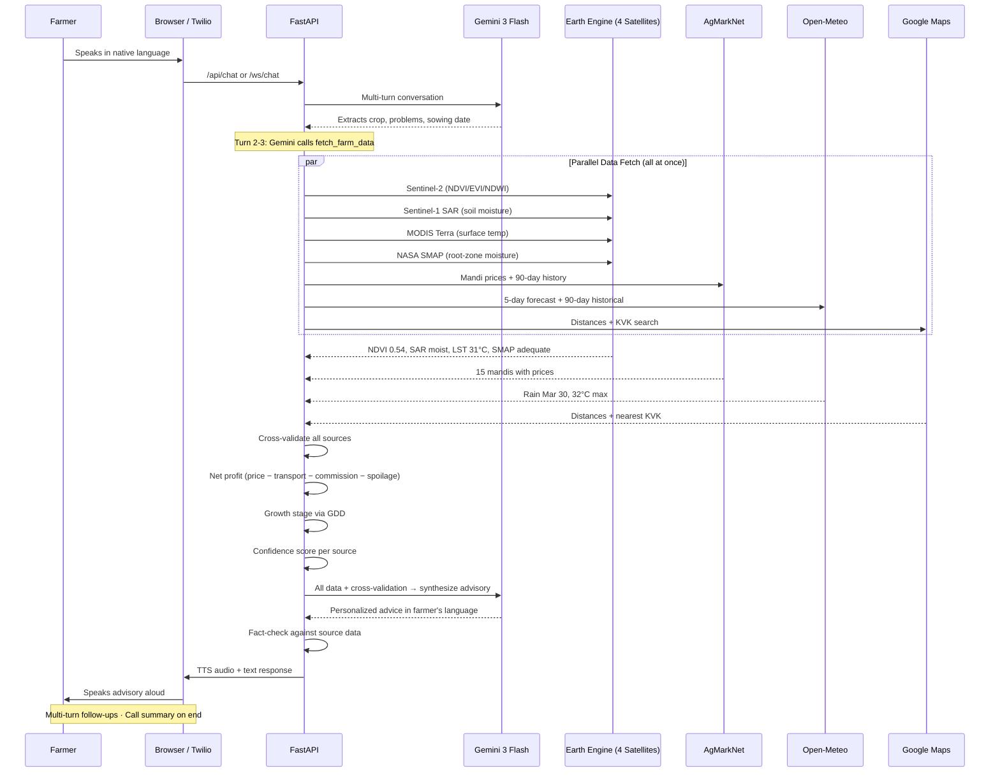

  
  
  

<h1 align="center">🌾 KisanMind (किसानमाइंड)</h1>
<h3 align="center">Satellite-to-Voice Agricultural Intelligence for 150M Indian Farmers</h3>

  <b>4 Satellites (Sentinel-2, SAR, MODIS, SMAP)</b> · <b>112 Crop Prices</b> · <b>5-Day Weather</b> · <b>Voice in 22 Languages</b> · <b>Twilio Phone Calls</b>

  
  

  
  
  
  
  
  

---

## Submission Requirements

| # | Requirement | Status | Link |
|---|-------------|--------|------|
| 1 | **GitHub Repository** — Public repo with source code, README, and commit history | ✅ | [github.com/divyamohan1993/kisanmind](https://github.com/divyamohan1993/kisanmind) |
| 2 | **3-Minute Pitch Video** — Problem, solution, and demo walkthrough | ✅ | [Watch on YouTube](#3-minute-pitch-video) |
| 3 | **Architecture Document** — Agent roles, communication, tools, error handling | ✅ | [See below](#architecture-overview) |
| 4 | **Impact Model** — Quantified business impact with stated assumptions | ✅ | [See below](#impact-model) |

---

## Contributors

| Name | GitHub |
|------|--------|
| Divya Mohan | [@divyamohan1993](https://github.com/divyamohan1993) |
| Kumkum Thakur | [@kumkum-thakur](https://github.com/kumkum-thakur) |

---

## Project Overview (Problem Statement #5: Domain-Specialized AI Agents)

**The problem:** 150M Indian farmers make ₹45 lakh crore in decisions annually — without seeing satellite data, comparing mandi net profits, or getting crop-specific weather actions in their language.

**Our solution:** One phone call. KisanMind fuses **9 real data sources** — 4 satellite constellations, government mandi prices, weather, Google Maps — into personalized voice advice in **22 Indian languages**. Every number from a verified API. Zero fake data.

It fuses **9 real data sources** in real-time:

| # | Source | What It Provides |
|---|--------|-----------------|
| 1 | **Sentinel-2** (10m) | Crop health — NDVI, EVI, NDWI indices |
| 2 | **Sentinel-1 SAR** (10m) | Radar soil moisture — works through clouds |
| 3 | **MODIS Terra** (1km) | Land surface temperature — heat stress detection |
| 4 | **NASA SMAP L4** (9km) | Root-zone moisture — 0–100cm deep |
| 5 | **AgMarkNet** | 112 commodity prices + 90-day history from data.gov.in |
| 6 | **Google Maps** | Driving distances, transport cost, nearest KVK |
| 7 | **Open-Meteo** | 5-day forecast + 90-day historical for GDD growth stage |
| 8 | **GPS** | Browser geolocation or manual village name input |
| 9 | **Gemini 3 Flash** | Advisory synthesis with 5-model fallback chain |

> **Deployment:** Live at [kisanmind.dmj.one](https://kisanmind.dmj.one) on a VM with systemd auto-deploy via GitHub webhook.

---

## 3-Minute Pitch Video

End-to-end walkthrough: a farmer calls in Hindi, the system detects intent, fetches live data from 4 satellites + mandi prices + weather, cross-validates sources, generates weather-timed advice with sell timing, and responds via voice — all in under 30 seconds.

<!-- Replace VIDEO_ID with the actual YouTube video ID when available -->

---

## Architecture Overview

### System Architecture

```mermaid
graph TB
    subgraph "Farmer Interface"
        A[Web Browser<br/>kisanmind.dmj.one] -->|Voice / Text| B[Next.js 16 Frontend<br/>WCAG 2.2 AAA]
        T[Phone Call<br/>+1 260-254-7946] -->|Twilio Webhook| D
    end

    subgraph "Backend — FastAPI"
        B -->|/api/*| D[FastAPI Backend<br/>Fully Async]
        D --> E[Gemini 3 Flash<br/>5-Model Fallback Chain]
        D --> WS[Gemini Live<br/>WebSocket Voice]
        D --> XV[Cross-Validation<br/>Multi-Source Conflict Detection]
    end

    subgraph "4 Satellites via Earth Engine"
        D -->|Sentinel-2| S2[NDVI / EVI / NDWI<br/>10m Crop Health]
        D -->|Sentinel-1 SAR| S1[VV / VH Backscatter<br/>Soil Moisture Through Clouds]
        D -->|MODIS Terra| MT[Day / Night LST<br/>1km Heat Stress]
        D -->|NASA SMAP L4| SM[Surface + Root-Zone<br/>9km Deep Moisture]
    end

    subgraph "Market + Weather + Location"
        D -->|data.gov.in| H[AgMarkNet<br/>112 Crops · 90-Day History]
        D -->|Open-Meteo| I[5-Day Forecast<br/>90-Day Historical · GDD]
        D -->|Maps Platform| J[Distance Matrix<br/>Geocoding · KVK Search]
    end

    subgraph "Voice Pipeline"
        D -->|STT V2| L[Cloud Speech-to-Text<br/>22 Languages]
        D -->|TTS| M[Cloud TTS Wavenet<br/>10 Indian Voices]
        D -->|Translation v3| N[Cloud Translation<br/>22 Languages]
    end

    subgraph "3-Tier Cache"
        D --> O[L0: Satellite Grid<br/>3,788 Points · O-1 Lookup]
        D --> P[L1: In-Memory · 0.13s]
        D --> Q[L2: Cloud Storage · ~200ms]
    end

    style A fill:#138808,color:#fff
    style T fill:#f43f5e,color:#fff
    style D fill:#1a365d,color:#fff
    style E fill:#6366f1,color:#fff
    style S2 fill:#22c55e,color:#fff
    style S1 fill:#FF9933,color:#fff
    style MT fill:#ef4444,color:#fff
    style SM fill:#38bdf8,color:#fff
```

### Voice Call Flow

### How Each Data Source Is Used

| Source | Raw Data | Processing | What Farmer Hears |
|--------|----------|-----------|-------------------|
| **Sentinel-2** | B2/B3/B4/B8 bands → NDVI/EVI/NDWI | Health classification, 30-day trend, district benchmark | "Aapki fasal ki sehat madhyam hai" |
| **Sentinel-1 SAR** | VV/VH backscatter (dB) | Moisture: wet/moist/dry/very_dry via C-band thresholds | "Mitti mein paani theek hai" |
| **MODIS Terra** | LST_Day/Night (scale × 0.02 − 273.15) | Heat stress: none/moderate/high/extreme | "Dhoop zyada hai, subah paani dein" |
| **NASA SMAP** | sm_surface + sm_rootzone (m³/m³) | Root-zone class + surface vs deep comparison | "Jad mein paani kam hai, gehra paani dein" |
| **AgMarkNet** | Modal/min/max prices per mandi per day | Net profit after transport + commission + spoilage | "Bhuntar mandi mein 7500 Rs/quintal" |
| **Open-Meteo** | Hourly temp, humidity, precip, wind | Daily aggregates + GDD accumulation | "Kal baarish hogi, chhidkaav mat karein" |
| **Google Maps** | Distance matrix (driving km + duration) | Transport cost at ₹3.5/km/quintal | "251 km door, 6 ghante ka safar" |

### Cross-Validation Engine

The system doesn't just relay data — it cross-validates across sources to catch contradictions:

| Conflict | Sources Compared | Action |
|----------|-----------------|--------|
| NDVI declining + adequate rain | Sentinel-2 vs Open-Meteo | Flag pest/disease → refer KVK (NOT irrigation) |
| NDVI declining + SAR confirms dry | Sentinel-2 vs Sentinel-1 | High-confidence irrigation recommendation |
| MODIS heat stress + flowering stage | MODIS vs GDD model | Crop protection alert with shade/irrigation advice |
| Rain forecast + harvest-ready stage | Open-Meteo vs GDD model | Urgent harvest-before-rain warning |
| Price rising + high market activity | AgMarkNet trend analysis | Hedge advice — sell partial, hold rest |
| Surface wet but root-zone dry | SMAP surface vs root-zone | Deep irrigation needed — surface rain didn't reach roots |

### Error Handling & Resilience

| Mechanism | Details |
|-----------|---------|
| **5-model fallback** | Gemini 3 Flash → 2.5 Flash → 2.0 Flash → 2.0 Flash Lite → 1.5 Flash |
| **Retry on 429** | Extracts API retry delay, waits (capped 15s), retries once per model |
| **Vertex AI fallback** | If all API key models exhausted, falls back to Vertex AI (billing-backed) |
| **3-tier cache** | L0 satellite grid (O(1)) + L1 memory (0.13s) + L2 GCS (~200ms) |
| **Stale-while-revalidate** | Serves cached data if all APIs fail; background refresh when possible |
| **Session cleanup** | Auto-evicts stale sessions (>1hr text, >7d call) to prevent memory leaks |
| **Graceful degradation** | If one satellite fails, others still return; advisory adapts to available data |
| **Confidence gating** | LOW confidence data is omitted; MEDIUM is hedged; only HIGH stated as advice |

### Tech Stack

| Layer | Technologies |
|-------|-------------|
| **AI/LLM** | Gemini 3 Flash (primary) + 5-model fallback chain + Vertex AI |
| **Voice Streaming** | Gemini Live (WebSocket, real-time audio ↔ text) |
| **Satellite** | Earth Engine — Sentinel-2 (10m), Sentinel-1 SAR, MODIS Terra (1km), NASA SMAP (9km) |
| **Backend** | FastAPI, Python 3.11+, fully async, uvicorn |
| **Frontend** | Next.js 16, React 19, TypeScript, Tailwind CSS 4, WCAG 2.2 AAA |
| **Market Data** | AgMarkNet / data.gov.in (112 commodities, 90-day price history + weather correlation) |
| **Weather** | Open-Meteo (5-day forecast + 90-day historical for GDD) |
| **Voice/Language** | Cloud STT V2, Cloud TTS Wavenet (10 voices), Cloud Translation v3 (22 languages) |
| **Phone** | Twilio Voice + SMS (TwiML webhooks, SMS summary after call) |
| **Maps** | Google Maps (Geocoding, Distance Matrix, Places for KVK search) |
| **Cache** | L0: Pre-computed satellite (O(1)) + L1: In-memory + L2: Cloud Storage |
| **Deployment** | VM with systemd + GitHub webhook auto-deploy (build + restart) |
| **Testing** | 140-test E2E suite covering all endpoints, edge cases, performance |
| **Accessibility** | WCAG 2.2 AAA — 7:1 contrast, ARIA labels, skip nav, reduced motion, 44px targets |

---

## Impact Model

> **Assumptions:** Conservative Year-1 estimates for 100,000 farmers. Average smallholder growing tomatoes or wheat, selling 30 quintals/season, 2 seasons/year.

| Metric | Mechanism | Value |
|--------|-----------|-------|
| Mandi arbitrage gain | Best mandi vs local mandi (net of transport, commission, spoilage) | **+₹12,000/season** |
| Spoilage prevention | Weather-timed harvesting + satellite-guided spray timing | **+₹10,000/season** |
| Input cost savings | Satellite-guided irrigation (SAR + SMAP moisture data) | **+₹2,000/season** |
| Time saved per query | Voice call vs visiting mandi + KVK + checking weather separately | **~4 hours** |
| Income increase per farmer | Combined effect across 2 seasons | **+30% (~₹34,000/year)** |
| Total value created (Year 1) | 100,000 farmers × ₹34,000 | **₹3.4 billion** |

### Worked Example: Solan Tomato Farmer

**Without KisanMind:**
- Sells at local Solan mandi at ₹1,800/quintal
- Loses ₹10,000/year to rain-damaged harvest
- Doesn't know soil is drying at root level (SMAP data unavailable to farmer)
- Annual tomato income: ₹50,000

**With KisanMind:**
- Sentinel-2 confirms NDVI 0.54 (moderate health, needs attention)
- Sentinel-1 SAR shows soil is moist — rules out water stress
- SMAP shows root-zone moisture adequate — no deep irrigation needed
- Cross-validation flags: "NDVI declining despite adequate moisture → possible pest issue → refer KVK"
- Weather warns of rain in 72 hours — harvest today
- MandiMitra finds Shimla mandi at ₹2,400/quintal (60km); after transport + commission + spoilage, net ₹2,104/quintal vs ₹1,728 locally
- 90-day price history shows prices are above average → sell now signal

**Result:** ₹376/quintal × 30 quintals = **₹11,280 gained** + ₹10,000 spoilage saved = **₹21,280 per harvest**

---

## Key Differentiators

| Feature | KisanMind | Typical Agri Apps |
|---------|-----------|-------------------|
| **Satellite sources** | 4 (Sentinel-2, SAR, MODIS, SMAP) | 0–1 |
| **Cross-validation** | Multi-source conflict detection | None |
| **Price intelligence** | Net profit after transport + spoilage + 90-day history | Raw prices only |
| **Languages** | 22 scheduled Indian languages | 1–2 |
| **Interface** | Voice-first (phone call) | App/text only |
| **Cache strategy** | 3-tier O(1) lookup | None or basic |
| **Accessibility** | WCAG 2.2 AAA | Not considered |
| **Data transparency** | Confidence scores + data age + source citations | Black box |

---

  &copy; 2026 KisanMind · Submitted for ET AI Hackathon 2026 — Phase II 
  Problem 5: Domain-Specialized AI Agents — Satellite-to-Voice Agricultural Intelligence 
  100% real data · 4 satellites · 112 crops · 22 languages · Zero hallucination

