# KisanMind System Architecture

> Comprehensive technical architecture of the KisanMind multi-agent agricultural advisory platform.

---

## Table of Contents

1. [High-Level System Overview](#1-high-level-system-overview)
2. [Agent Roles & Responsibilities](#2-agent-roles--responsibilities)
3. [Agent Communication & Orchestration](#3-agent-communication--orchestration)
4. [Tool Integrations & External APIs](#4-tool-integrations--external-apis)
5. [Data Flow: End-to-End Request Lifecycle](#5-data-flow-end-to-end-request-lifecycle)
6. [Voice Pipeline Architecture](#6-voice-pipeline-architecture)
7. [Caching Architecture](#7-caching-architecture)
8. [Error Handling & Resilience](#8-error-handling--resilience)
9. [Frontend-Backend Communication](#9-frontend-backend-communication)
10. [Deployment Architecture](#10-deployment-architecture)
11. [Security & Guardrails](#11-security--guardrails)

---

## 1. High-Level System Overview

KisanMind is a **voice-first, multi-agent agricultural advisory system** serving 150M Indian farmers across 22 languages. It fuses satellite imagery, mandi (market) prices, weather forecasts, and voice I/O into a single platform accessible via phone call or web app.

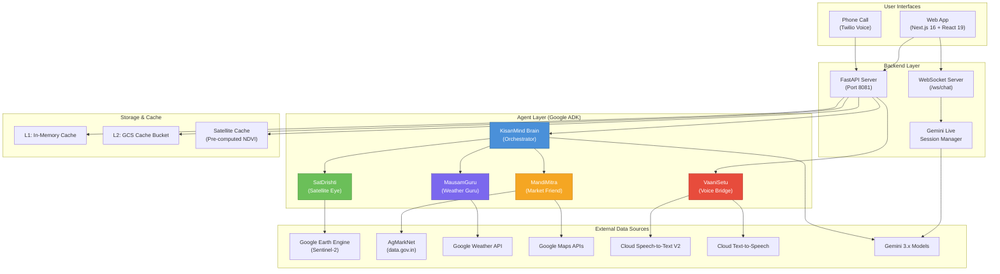

**Tech Stack Summary:**

| Layer | Technology |
|-------|-----------|
| Frontend | Next.js 16.2.1 + React 19 + Tailwind CSS |
| Backend | FastAPI + Uvicorn (Python 3.11+) |
| Agent Framework | Google ADK (Agent Development Kit) |
| LLM | Gemini 3.1 Pro (orchestrator) + Gemini 3 Flash (agents) |
| Satellite | Google Earth Engine (Sentinel-2, Sentinel-1, MODIS, SMAP) |
| Market Data | AgMarkNet / data.gov.in REST API |
| Weather | Google Maps Weather API |
| Voice | Cloud Speech V2 + Cloud TTS + Gemini Live |
| Phone | Twilio Voice + SMS |
| Cache | In-memory dict (L1) + GCS (L2) |
| Deployment | Docker multi-stage + Google Cloud Run |

---

## 2. Agent Roles & Responsibilities

The system uses a **hierarchical agent architecture** with one orchestrator and four specialist agents. Each agent has a distinct domain, its own Gemini model instance, and a set of tools.

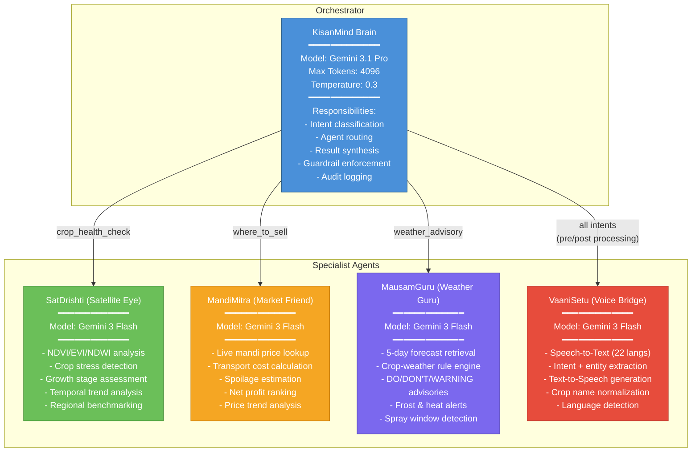

### Agent Detail Cards

#### KisanMind Brain (Orchestrator)
- **File:** `agents/brain/orchestrator.py`
- **Config:** `agents/brain/config.yaml`
- **Model:** `gemini-3.1-pro-preview` (higher reasoning for synthesis)
- **Tool:** `_get_advisory_tool()` - wraps the entire advisory pipeline
- **System Prompt Personality:** Simple farmer-friendly language, rural analogies, empathetic tone
- **Guardrails:** No pesticide brands, no loan advice, no yield guarantees, mandatory disclaimers

#### SatDrishti (Satellite Eye)
- **File:** `agents/sat_drishti/agent.py`
- **Supporting:** `earth_engine.py`, `ndvi_interpreter.py`
- **Tool:** `analyze_crop_health(lat, lon, crop, region, benchmarks)`
- **Data Source:** Sentinel-2 via Google Earth Engine
- **NDVI Categories:** bare_soil (0-0.1), stressed (0.1-0.3), moderate (0.3-0.5), healthy (0.5-0.7), peak (0.7-0.9)

#### MandiMitra (Market Friend)
- **File:** `agents/mandi_mitra/agent.py`
- **Supporting:** `agmarknet_client.py`, `profit_optimizer.py`
- **Tools:** `get_mandi_recommendation()`, `get_crop_prices()`
- **Data Sources:** AgMarkNet API + Google Maps Distance Matrix
- **Profit Formula:** `Net = Modal Price - Transport (₹3.50/km/qtl) - Commission (4%) - Spoilage`

#### MausamGuru (Weather Guru)
- **File:** `agents/mausam_guru/agent.py`
- **Supporting:** `openweather_client.py`, `crop_weather_rules.py`
- **Tool:** `get_weather_advisory(lat, lon, crop, growth_stage)`
- **Advisory Types:** DO, DON'T, WARNING (with HIGH/MEDIUM/LOW urgency)
- **Supported Crops:** tomato, wheat, rice, apple, coffee (with per-stage rules)

#### VaaniSetu (Voice Bridge)
- **File:** `agents/vaani_setu/agent.py`
- **Supporting:** `stt_handler.py`, `tts_handler.py`, `intent_extractor.py`
- **Tools:** `process_voice_input()`, `process_text_input()`, `generate_voice_response()`, `get_routing_target()`
- **Crop Normalization:** 80+ mappings (Hindi/Tamil/Telugu regional names to English)
- **Voice Rules:** Simple language, local units (bigha/quintal/rupaye), 3-5 sentences max, address as "kisan bhai/behan"

---

## 3. Agent Communication & Orchestration

### Intent-Based Routing

The orchestrator classifies farmer queries into intents and routes to the appropriate specialist agents. For `full_advisory`, all three data agents execute **in parallel** using `asyncio.gather`.

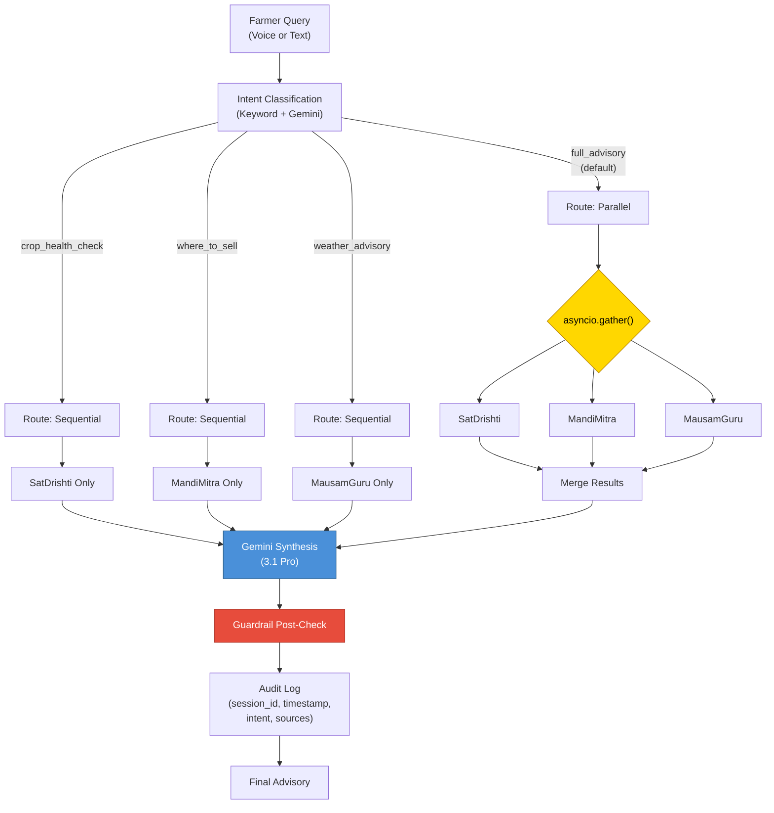

### Parallel Execution Model

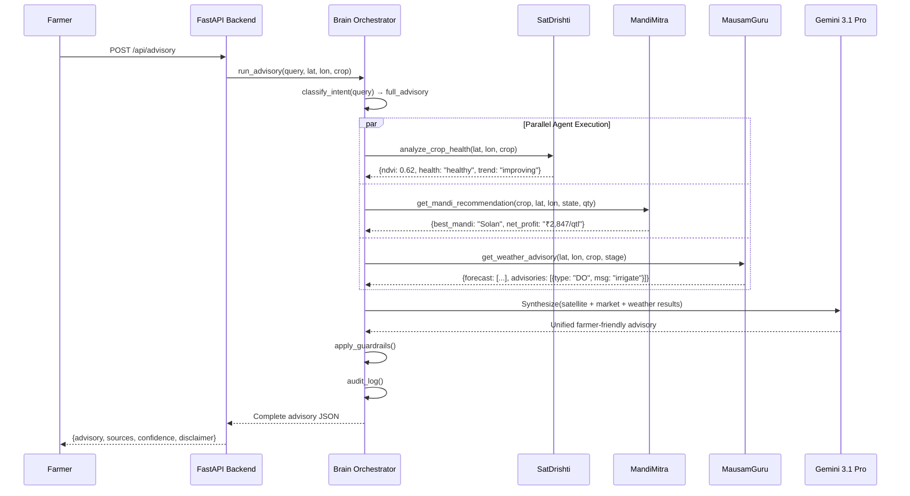

### Agent Registration (config.yaml)

```yaml
sub_agents:
  sat_drishti:
    triggers: ["crop_health_check", "full_advisory"]
    capabilities: ["ndvi_analysis", "crop_stress_detection", "growth_stage_assessment"]

  mandi_mitra:
    triggers: ["where_to_sell", "full_advisory"]
    capabilities: ["mandi_price_lookup", "profit_calculation", "transport_route_optimization"]

  mausam_guru:
    triggers: ["weather_advisory", "full_advisory"]
    capabilities: ["weather_forecast", "frost_alert", "irrigation_scheduling", "spray_window_detection"]

  vaani_setu:
    triggers: ["all"]
    capabilities: ["speech_to_text", "text_to_speech", "language_translation"]
```

---

## 4. Tool Integrations & External APIs

Each agent wraps one or more external APIs through dedicated tool functions. The backend also directly calls some APIs for the REST/WebSocket paths.

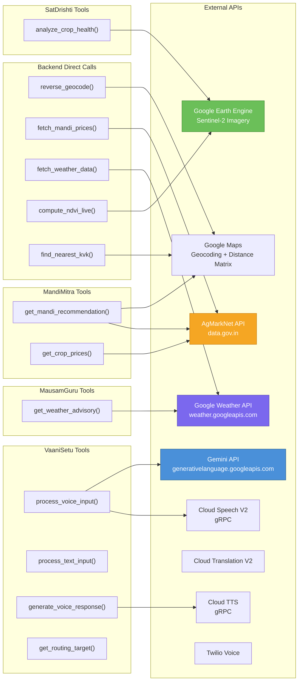

### API Integration Details

| API | Endpoint | Auth | Agent/Module | Data Returned |
|-----|----------|------|-------------|---------------|
| **Google Earth Engine** | Python `ee` library | Service Account | SatDrishti / `earth_engine.py` | NDVI, EVI, NDWI, thumbnail URL |
| **AgMarkNet** | `api.data.gov.in/resource/9ef84268-...` | API Key | MandiMitra / `agmarknet_client.py` | Commodity prices by mandi |
| **Google Weather** | `weather.googleapis.com/v1/forecast/hours:lookup` | API Key | MausamGuru / `openweather_client.py` | 120-hour hourly forecast |
| **Google Maps Geocoding** | `maps.googleapis.com/maps/api/geocode/json` | API Key | Backend / `main.py` | Lat/lon from address |
| **Google Maps Distance** | `maps.googleapis.com/maps/api/distancematrix/json` | API Key | MandiMitra / `profit_optimizer.py` | Travel distance & time |
| **Cloud Speech V2** | gRPC service | Service Account | VaaniSetu / `stt_handler.py` | Transcript + language |
| **Cloud TTS** | gRPC service | Service Account | VaaniSetu / `tts_handler.py` | Audio bytes (WAV/MP3) |
| **Cloud Translation** | gRPC service | Service Account | Backend / `main.py` | Translated text |
| **Gemini API** | `generativelanguage.googleapis.com` | API Key | All agents + Backend | Generated text/audio |
| **Gemini Live** | WebSocket | API Key | Backend / `gemini_live.py` | Streaming audio + text |
| **Twilio Voice** | REST API | Account SID + Token | Backend / `main.py` | Phone call management |

### Cloud Functions (Serverless)

Five Google Cloud Functions provide standalone API wrappers:

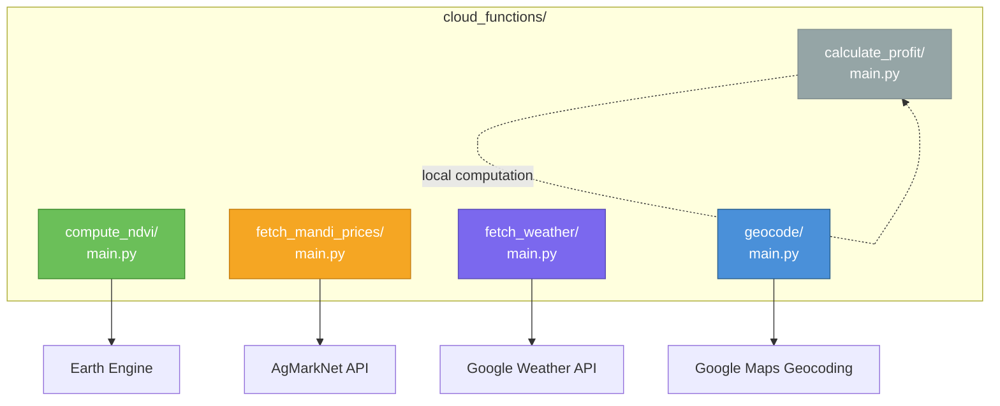

---

## 5. Data Flow: End-to-End Request Lifecycle

### Full Advisory Request (REST)

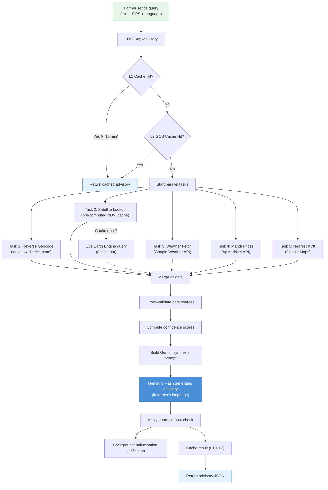

### Advisory Response Structure

```json
{
  "advisory": "Farmer-friendly text in their language...",
  "satellite": {
    "ndvi": 0.62, "health": "healthy", "trend": "improving",
    "confidence": "HIGH", "image_date": "2026-03-27"
  },
  "weather": {
    "forecast_days": [...],
    "advisories": [{"type": "DO", "msg": "irrigate", "urgency": "HIGH"}]
  },
  "mandi": {
    "best_mandi": "Solan", "net_profit_per_quintal": 2847,
    "alternatives": [...]
  },
  "kvk": {"name": "KVK Solan", "distance_km": 12, "phone": "..."},
  "confidence": {"overall": 0.82, "satellite": 0.9, "weather": 0.8, "price": 0.75},
  "sources": ["Sentinel-2 (2026-03-27)", "AgMarkNet", "Google Weather API"],
  "disclaimer": "Advisory is indicative. Verify with local conditions."
}
```

---

## 6. Voice Pipeline Architecture

### Web Voice Call Flow

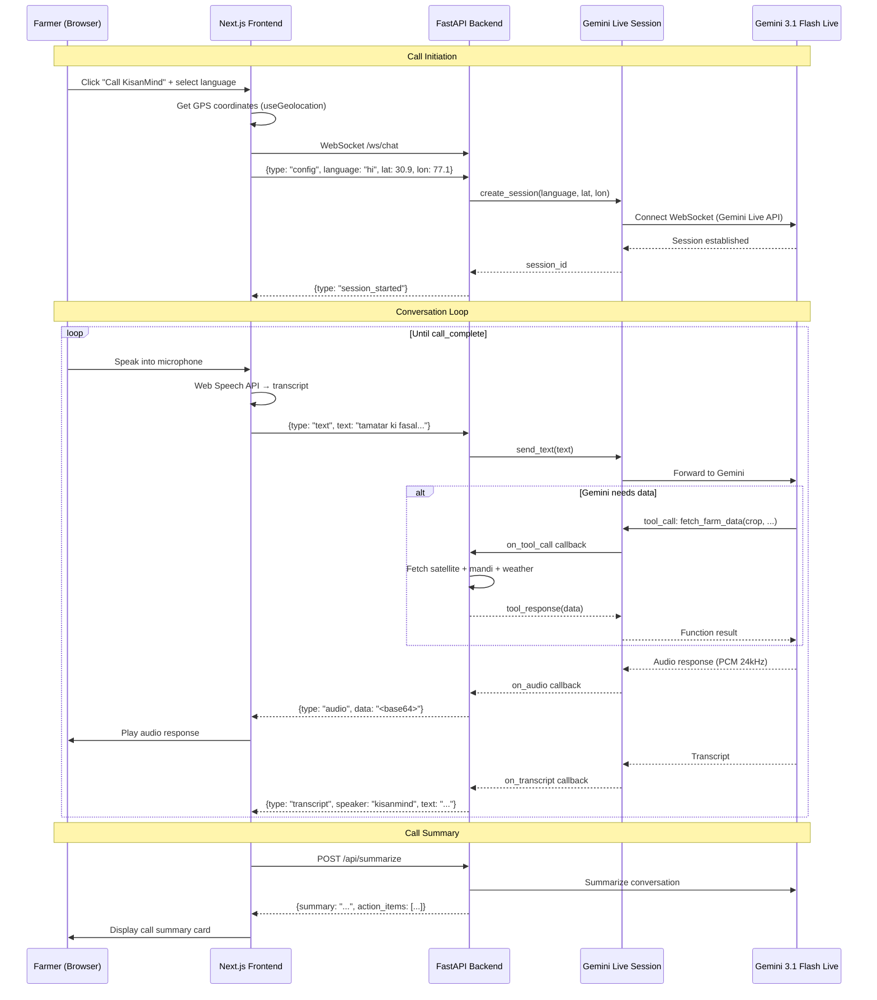

### Twilio Phone Call Flow

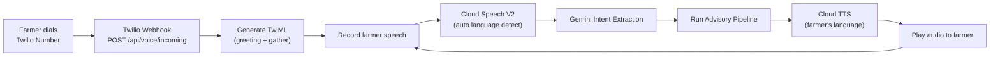

### Language Support Matrix

| Language | Code | STT | TTS Voice | Gemini Native |
|----------|------|-----|-----------|---------------|
| Hindi | hi-IN | V2 Native | Wavenet-D | Yes |
| English | en-IN | V2 Native | Wavenet-D | Yes |
| Tamil | ta-IN | V2 Native | Wavenet-D | Yes |
| Telugu | te-IN | V2 Native | Standard-A | Yes |
| Bengali | bn-IN | V2 Native | Wavenet-D | Yes |
| Marathi | mr-IN | V2 Native | Wavenet-A | Yes |
| Gujarati | gu-IN | V2 Native | Wavenet-A | Yes |
| Kannada | kn-IN | V2 Native | Wavenet-A | Yes |
| Malayalam | ml-IN | V2 Native | Wavenet-A | Yes |
| Punjabi | pa-IN | V2 Native | Wavenet-A | Yes |
| Odia | or-IN | V2 Native | Standard-A | Via Hindi fallback |
| Assamese | as-IN | V2 Native | Via Hindi TTS | Via Hindi fallback |
| + 10 more | - | Via Hindi | Via Hindi TTS | Via Hindi fallback |

---

## 7. Caching Architecture

The system implements a **two-tier caching strategy** optimized for rural connectivity (where latency matters most) plus a specialized satellite data cache.

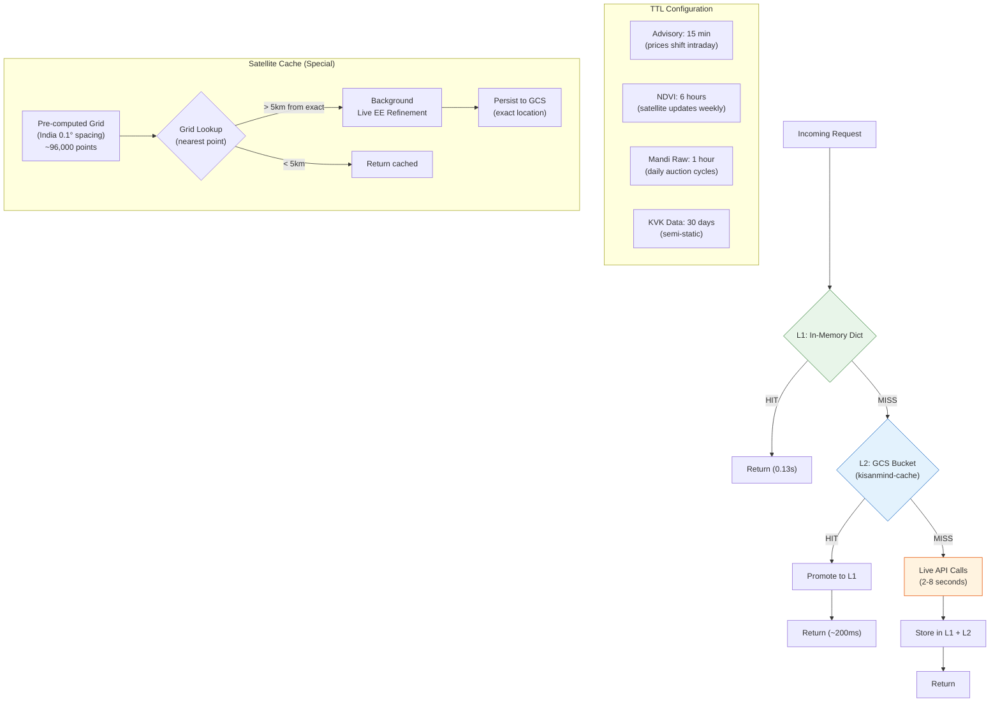

### Cache Key Strategy

| Data Type | Key Pattern | Example |
|-----------|------------|---------|
| Advisory | `adv:{lat:.2f}:{lon:.2f}:{crop}:{lang}` | `adv:30.91:77.10:tomato:hi` |
| NDVI | `ndvi:{lat:.4f}:{lon:.4f}` | `ndvi:30.9100:77.0969` |
| Mandi Prices | `mandi:{commodity}:{state}` | `mandi:tomato:himachal_pradesh` |
| Weather | `wx:{lat:.2f}:{lon:.2f}` | `wx:30.91:77.10` |
| KVK | `kvk:{lat:.1f}:{lon:.1f}` | `kvk:30.9:77.1` |
| Geocode | `geo:{lat:.4f}:{lon:.4f}` | `geo:30.9100:77.0969` |

---

## 8. Error Handling & Resilience

### Error Handling Strategy

The system follows a **graceful degradation** philosophy: every external dependency has a fallback path, and no single API failure prevents an advisory from being generated.

```mermaid
flowchart TD
    subgraph "Satellite Data"
        S1["Pre-computed Cache"] -->|"miss"| S2["Live Earth Engine<br/>(8s timeout)"]
        S2 -->|"timeout/error"| S3["Neighbor Grid Point<br/>(within 10km)"]
        S3 -->|"miss"| S4["District Average"]
        S4 -->|"miss"| S5["Advisory without<br/>satellite data<br/>(confidence: LOW)"]
    end

    subgraph "Mandi Prices"
        M1["GCS Cached Prices"] -->|"stale/miss"| M2["AgMarkNet API<br/>(5s timeout)"]
        M2 -->|"error"| M3["AgMarkNet Alternate<br/>Endpoint"]
        M3 -->|"error"| M4["Hardcoded<br/>Commodity List"]
        M4 -->|"still empty"| M5["Advisory without<br/>price data"]
    end

    subgraph "Weather Data"
        W1["Google Weather API<br/>(5s timeout)"] -->|"error"| W2["Cached Weather<br/>(if < 3hrs old)"]
        W2 -->|"miss"| W3["Advisory without<br/>weather data"]
    end

    subgraph "Voice Pipeline"
        V1["Speech-to-Text"] -->|"confidence < 0.6"| V2["Retry prompt:<br/>'Please repeat'"]
        V2 -->|"2nd failure"| V3["Fall back to<br/>text input"]
        V4["Text-to-Speech"] -->|"error"| V5["Return text-only<br/>response"]
    end

    subgraph "Gemini LLM"
        G1["Gemini API Call"] -->|"rate limit/error"| G2["Retry with<br/>exponential backoff"]
        G2 -->|"3 failures"| G3["Template-based<br/>advisory fallback"]
    end

    style S5 fill:#FFF3E0,stroke:#E65100
    style M5 fill:#FFF3E0,stroke:#E65100
    style W3 fill:#FFF3E0,stroke:#E65100
    style V3 fill:#FFF3E0,stroke:#E65100
    style G3 fill:#FFF3E0,stroke:#E65100
```

### Error Handling Patterns by Layer

```mermaid
graph TB
    subgraph "Pattern 1: Timeout Protection"
        TP1["asyncio.wait_for(task, timeout=8.0)"]
        TP2["except asyncio.TimeoutError"]
        TP3["log.warning + proceed without data"]
        TP1 --> TP2 --> TP3
    end

    subgraph "Pattern 2: Credential Fallback Chain"
        CF1["ENV var JSON string"]
        CF2["File path from ENV"]
        CF3["Application Default Credentials"]
        CF1 -->|"fail"| CF2 -->|"fail"| CF3
    end

    subgraph "Pattern 3: API Retry with Variants"
        AR1["Primary endpoint"]
        AR2["Alternate endpoint/params"]
        AR3["Cached fallback"]
        AR4["Hardcoded defaults"]
        AR1 -->|"fail"| AR2 -->|"fail"| AR3 -->|"fail"| AR4
    end

    subgraph "Pattern 4: Error as Data"
        ED1["Agent tool raises exception"]
        ED2["Return {error: str, advice: 'fallback text'}"]
        ED3["Orchestrator handles gracefully"]
        ED1 --> ED2 --> ED3
    end

    subgraph "Pattern 5: Confidence Gating"
        CG1["Score each data source (0-1)"]
        CG2{"Confidence Level"}
        CG3["HIGH → Clear directive"]
        CG4["MEDIUM → Hedged language"]
        CG5["LOW → Skip or 'consult KVK'"]
        CG1 --> CG2
        CG2 --> CG3
        CG2 --> CG4
        CG2 --> CG5
    end
```

### Confidence Scoring System

Every advisory includes transparency about data quality:

```
Confidence Score = weighted_average(satellite, weather, price)

satellite_score:
  - Base: 0.5
  - Bonus: +0.3 if image ≤ 3 days old
  - Bonus: +0.1 if image ≤ 7 days old
  - Penalty: -0.2 if image > 7 days old

weather_score: 0.7-0.8 (5-day forecast inherent uncertainty)

price_score:
  - HIGH (0.8): ≥ 5 data points, < 24 hrs old
  - MEDIUM (0.6): 2-4 data points
  - LOW (0.4): ≤ 1 data point or stale

overall_confidence = (sat * 0.35 + weather * 0.30 + price * 0.35)
```

### Cross-Validation Logic

The backend cross-validates data sources for consistency (`cross_validate_data_sources()`):

- **Weather vs Satellite:** If satellite shows stress but weather shows adequate rain → CAVEAT
- **Price vs Weather:** If heavy rain forecast and prices rising → WARNING (supply disruption)
- **NDVI vs Growth Stage:** If NDVI below benchmark for current stage → CONFLICT alert

---

## 9. Frontend-Backend Communication

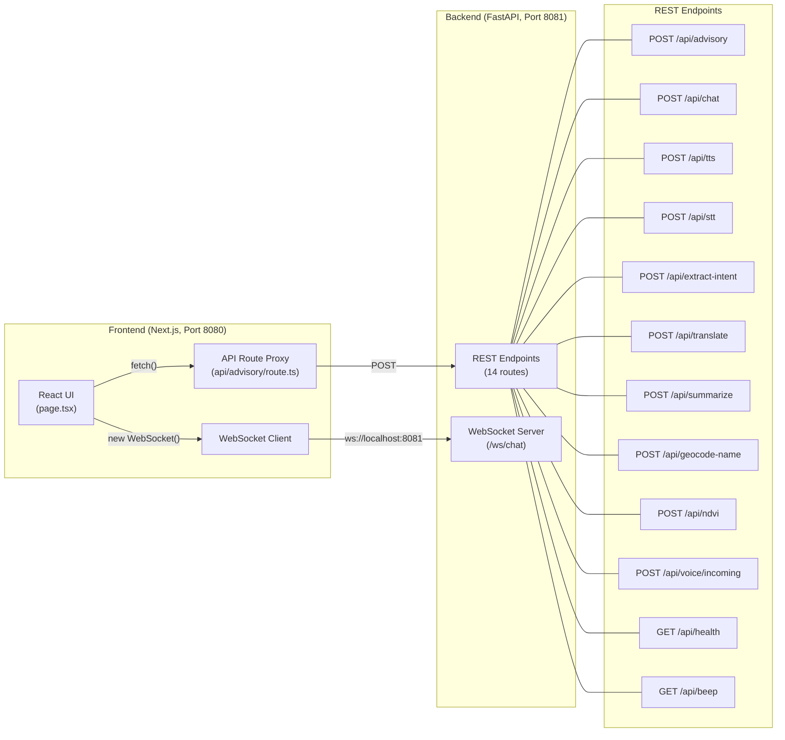

### WebSocket Message Protocol

```
Client → Server:
  {"type": "config", "language": "hi", "latitude": 30.9, "longitude": 77.1}
  {"type": "text", "text": "tamatar ki fasal kaisi hai?"}
  {"type": "audio", "data": "<base64 PCM 16kHz mono>"}
  {"type": "end"}

Server → Client:
  {"type": "session_started", "session_id": "uuid"}
  {"type": "audio", "data": "<base64 PCM 24kHz>"}
  {"type": "transcript", "speaker": "farmer|kisanmind", "text": "..."}
  {"type": "status", "status": "fetching_data|ready"}
  {"type": "turn_complete"}
  {"type": "error", "message": "..."}
```

### Frontend Component Architecture

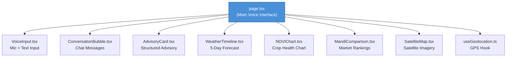

---

## 10. Deployment Architecture

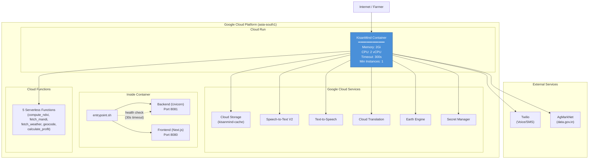

### Docker Build (Multi-Stage)

```
Stage 1: Frontend Build (Node.js 20)
├── npm install
└── npm run build → .next/ static output

Stage 2: Production Image (Python 3.11)
├── Install system deps + Node.js 20
├── pip install requirements.txt
├── Copy: backend/, agents/, cloud_functions/, data/, scripts/
├── Copy: .next/ from Stage 1
├── ENV: PORT=8080, PYTHONUNBUFFERED=1
└── CMD: infrastructure/entrypoint.sh
```

### Startup Sequence

```
1. entrypoint.sh starts
2. Launch Uvicorn (backend, port 8081) in background
3. Wait for /api/health to return 200 (30s timeout)
4. Launch Next.js server (frontend, port 8080)
5. Wait for either process to exit
```

---

## 11. Security & Guardrails

### Content Safety Guardrails

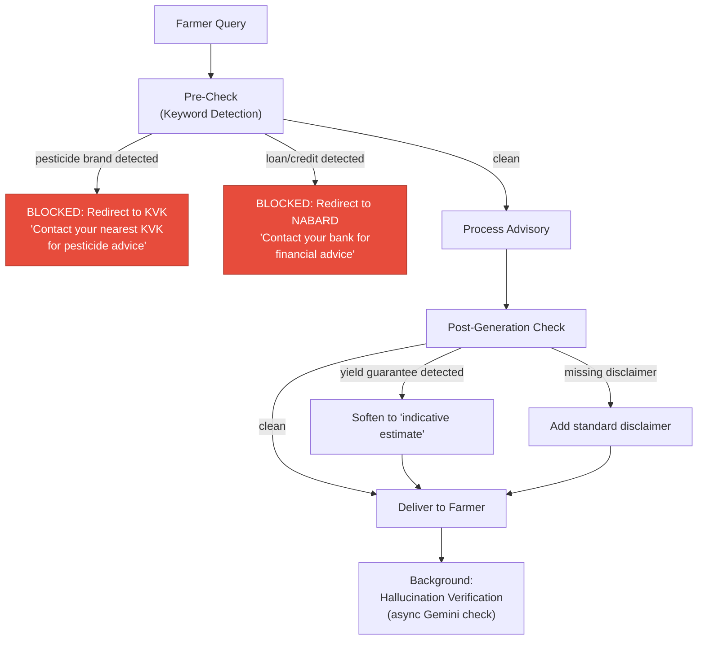

### Guardrail Rules

| Rule | Enforcement | Redirect |
|------|-------------|----------|
| No pesticide brand names | Keyword filter + LLM system prompt | Local KVK (1800-180-1551) |
| No loan/credit/investment advice | Keyword filter + LLM system prompt | Bank / NABARD |
| No yield guarantees | Post-generation check | Marked as "indicative" |
| Data source citations | Mandatory in synthesis prompt | Always included |
| Standard disclaimer | Template appended | Every advisory |
| Audit logging | Every session logged | UUID-tracked |
| Confidence transparency | Computed per data source | Shown to farmer |

### API Key Management

```
Credential Loading Priority:
1. Environment variable (JSON string)    ← Preferred in Cloud Run
2. Environment variable (file path)      ← Local development
3. Application Default Credentials       ← GCE/Cloud Run auto-detect
```

All API keys are loaded from environment variables (`.env` file locally, Secret Manager in production). No secrets are hardcoded in application code.

---

## Appendix: File Map

```
kisanmind/
├── backend/
│   ├── main.py                    # FastAPI server (3400+ lines, all endpoints)
│   ├── gemini_live.py             # Gemini Live WebSocket session manager
│   ├── satellite_cache.py         # Two-tier NDVI cache (L1 + L2)
│   ├── requirements.txt           # Python dependencies
│   └── Dockerfile
├── frontend/
│   ├── app/
│   │   ├── page.tsx               # Main voice-first UI (23KB)
│   │   ├── layout.tsx             # Root layout
│   │   ├── globals.css            # Tailwind styles
│   │   ├── components/
│   │   │   ├── AdvisoryCard.tsx
│   │   │   ├── ConversationBubble.tsx
│   │   │   ├── MandiComparison.tsx
│   │   │   ├── NDVIChart.tsx
│   │   │   ├── SatelliteMap.tsx
│   │   │   ├── VoiceInput.tsx
│   │   │   └── WeatherTimeline.tsx
│   │   ├── hooks/useGeolocation.ts
│   │   └── api/advisory/route.ts  # Backend proxy
│   ├── package.json
│   └── Dockerfile
├── agents/
│   ├── brain/
│   │   ├── orchestrator.py        # Root orchestrator
│   │   └── config.yaml            # Agent routing config
│   ├── sat_drishti/
│   │   ├── agent.py               # Satellite analysis agent
│   │   ├── earth_engine.py        # Earth Engine integration
│   │   └── ndvi_interpreter.py    # NDVI classification
│   ├── mandi_mitra/
│   │   ├── agent.py               # Market price agent
│   │   ├── agmarknet_client.py    # AgMarkNet API client
│   │   └── profit_optimizer.py    # Net profit ranking
│   ├── mausam_guru/
│   │   ├── agent.py               # Weather advisory agent
│   │   ├── openweather_client.py  # Weather API client
│   │   └── crop_weather_rules.py  # Crop-weather thresholds
│   └── vaani_setu/
│       ├── agent.py               # Voice bridge agent
│       ├── intent_extractor.py    # Intent + entity extraction
│       ├── stt_handler.py         # Speech-to-Text
│       └── tts_handler.py         # Text-to-Speech
├── cloud_functions/               # 5 serverless API wrappers
├── data/
│   ├── bigquery/                  # Reference CSVs (crop calendar, mandis, benchmarks)
│   ├── earth_engine/              # EE JavaScript scripts
│   ├── knowledge_base/            # Crop guides, schemes, pest info
│   └── satellite_cache/           # Pre-computed NDVI JSONs (~16 files)
├── infrastructure/
│   ├── setup.sh                   # One-command project setup
│   ├── deploy.sh                  # Cloud Run deployment
│   └── entrypoint.sh              # Docker entrypoint
├── scripts/
│   ├── precompute_satellite.py    # India grid NDVI pre-computation
│   └── refresh_mandi_cache.py     # Market price cache refresh
├── Dockerfile                     # Multi-stage production build
└── .env                           # Environment configuration
```
